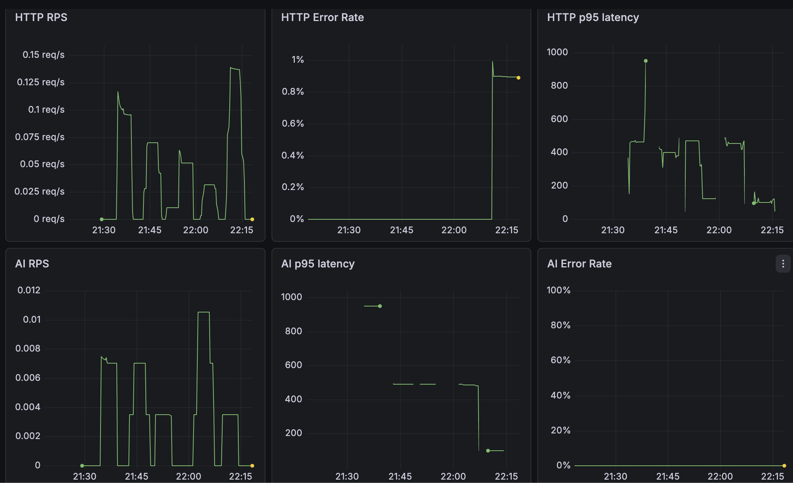

# TeamTask Manager

TeamTask Manager is a collaborative task management platform built with a Node.js/Express backend, a Vite/React frontend, PostgreSQL, Prisma ORM, and real-time communication via Socket.IO.

The project also demonstrates practical DevOps and cloud deployment workflows, including Docker Compose, Nginx reverse proxy, GitHub Actions CI/CD, deployment on Google Cloud Platform, HTTPS with Let’s Encrypt/Certbot, and local observability with Prometheus and Grafana.

🔗 Live demo: https://minhph.xyz

---

## Features

- User authentication and account management
- Group, list, task, comment, and member management
- RESTful APIs using Node.js and Express
- Real-time communication with Socket.IO
- Gemini-powered chatbot for task-related queries and summaries
- PostgreSQL database managed with Prisma ORM
- Backend metrics instrumentation for observability

---

## Tech Stack

**Backend:** Node.js, Express, Prisma ORM, PostgreSQL, Socket.IO, Jest  
**Frontend:** React, Vite, TypeScript  
**DevOps & Cloud:** Docker, Docker Compose, Nginx, Certbot, GitHub Actions, GCP Compute Engine, Linux  
**Observability:** Prometheus, Grafana, prom-client

---

## Architecture

```txt
Client
  |
  | HTTPS
  v
Nginx Reverse Proxy
  |
  |-- Frontend service
  |
  |-- Backend API service
        |
        |-- PostgreSQL
        |-- Gemini API
        |-- Prometheus metrics
```

Production is deployed on a GCP Compute Engine VM using Docker Compose. Nginx handles reverse proxy routing, SSL termination, and HTTP-to-HTTPS redirection.

---

## Repository Structure

```txt
.
├── src/                    # Backend source code
├── frontend/               # Frontend source code
├── prisma/                 # Prisma schema and migrations
├── nginx/                  # Nginx production configuration
├── prometheus/             # Prometheus configuration
├── grafana/                # Grafana provisioning
├── .github/workflows/      # GitHub Actions CI/CD workflow
├── Dockerfile              # Backend Dockerfile
├── docker-compose.dev.yml  # Development Docker Compose file
├── docker-compose.prod.yml # Production Docker Compose file
└── deploy.sh               # Deployment script
```

---

## Local Development

Start the local development environment:

```bash
docker compose -f docker-compose.dev.yml up -d --build
```

Default local services:

```txt
Frontend:   http://localhost:5173
Backend:    http://localhost:5001
Prometheus: http://localhost:9090
Grafana:    http://localhost:3000
```

Default Grafana credentials:

```txt
Username: admin
Password: admin
```

---

## Production Deployment

Production runs on a GCP Compute Engine VM.

Start production services:

```bash
docker compose -f docker-compose.prod.yml up -d --build
```

Production services:

- `teamtask-frontend`
- `teamtask-backend`
- `teamtask-db`
- `teamtask-nginx`
- `teamtask-certbot`

Nginx exposes ports `80` and `443`.

---

## Nginx & HTTPS

Production routing is defined in:

```txt
nginx/prod.conf
```

Main routes:

```txt
/             -> frontend:80
/api/         -> backend:5000
/socket.io/   -> backend:5000
```

Nginx handles:

- Reverse proxy routing
- HTTP to HTTPS redirect
- SSL termination
- Socket.IO upgrade headers
- ACME challenge path for Certbot

HTTPS is configured using Let’s Encrypt and Certbot.

Certbot uses the webroot challenge path:

```txt
/var/www/certbot
```

Certificates are stored in:

```txt
/etc/letsencrypt
```

Renew certificates:

```bash
docker compose -f docker-compose.prod.yml run --rm certbot renew
docker restart teamtask-nginx
```

---

## CI/CD

CI/CD is implemented with GitHub Actions.

Workflow file:

```txt
.github/workflows/cicd.yml
```

Pipeline steps:

- Install backend dependencies
- Generate Prisma client
- Apply Prisma migrations
- Run backend tests
- Install and build frontend
- Deploy to the GCP server via SSH on push to `main`

Main production deploy commands:

```bash
docker compose -f docker-compose.prod.yml up -d --build
docker compose -f docker-compose.prod.yml exec -T backend npm run migrate:deploy
```

Required GitHub Actions secrets:

```txt
DEPLOY_HOST
DEPLOY_USER
DEPLOY_SSH_KEY
DEPLOY_PATH
SMTP_USER
SMTP_PASS
```

---

## Observability

The backend is instrumented with custom metrics using `prom-client`.

Prometheus and Grafana are configured for local development observability.

Key metrics include:

```txt
teamtask_http_requests_total
teamtask_http_request_duration_ms
teamtask_ai_requests_total
teamtask_ai_request_duration_ms
teamtask_ai_request_errors_total
```

Example Grafana dashboard:



---

## Useful Commands

Check running containers:

```bash
docker ps
```

View production logs:

```bash
docker compose -f docker-compose.prod.yml logs --no-color
```

Run database migrations:

```bash
docker compose -f docker-compose.prod.yml exec -T backend npm run migrate:deploy
```

Restart Nginx:

```bash
docker restart teamtask-nginx
```

Check HTTPS:

```bash
curl -I https://minhph.xyz
```

Clean Docker cache if disk is low:

```bash
docker builder prune -af
docker image prune -af
docker container prune -f
```

---

## Notes

- Monitoring with Prometheus and Grafana is currently configured for local development.
- Production deployment focuses on the application stack, Nginx reverse proxy, HTTPS, and CI/CD deployment on GCP.
- Let’s Encrypt certificates must be renewed before expiry using the Certbot renew command.