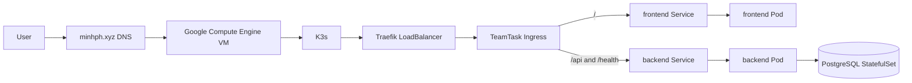
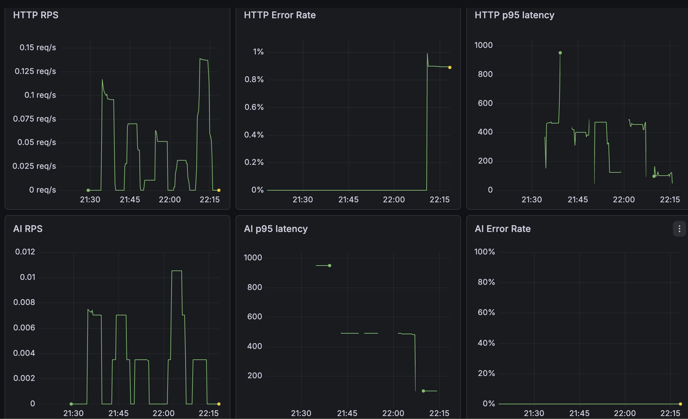

# TeamTask Manager

TeamTask Manager is a collaborative task-management application built with React, Express, Socket.IO, and PostgreSQL. It supports workspaces, task boards, comments, checklists, authentication, real-time messaging, file uploads, and an optional AI assistant; its portfolio focus is the DevOps workflow used to containerize, deploy, secure, automate, and monitor the system.

**Live demo:** [https://minhph.xyz](https://minhph.xyz)

## Project Overview

- Shared workspaces with task boards, lists, labels, comments, and checklists
- Deadlines, notifications, attachments, direct messaging, and password reset
- JWT authentication and Socket.IO real-time communication
- Optional AI assistant for task-related queries
- Prometheus metrics for HTTP and AI request activity

## Production Architecture


```mermaid
flowchart LR
    U[User] --> DNS[minhph.xyz DNS]
    DNS --> VM[Google Compute Engine VM]
    VM --> K[K3s]
    K --> T[Traefik LoadBalancer]
    T --> I[TeamTask Ingress]
    I -->|/| FS[frontend Service]
    I -->|/api and /health| BS[backend Service]
    FS --> FP[frontend Pod]
    BS --> BP[backend Pod]
    BP --> PG[(PostgreSQL StatefulSet)]
```

The `teamtask` namespace contains one frontend Deployment, one backend Deployment, ClusterIP Services for each application, and a PostgreSQL StatefulSet exposed through a headless Service. The PostgreSQL StatefulSet provisions a `5Gi` `ReadWriteOnce` volume claim.

## CI/CD Pipeline

```text
Git push / pull request to main
        |
        v
GitHub Actions CI
  - path-filtered lint, tests, Prisma migration check, frontend build
  - kubectl kustomize validation for the K3s overlay
        |
        v  (successful CI on main)
Docker Buildx -> GHCR
        |
        v
SSH to GCE VM
        |
        v
Temporary Kustomize overlay with commit-SHA image tag
        |
        v
k3s kubectl apply -k
        |
        v
Migration Job completion -> backend/frontend rollout verification
```

GitHub Actions builds backend and frontend images with Docker Buildx and pushes an immutable commit-SHA tag plus `latest` to GHCR. The deploy step connects to the VM over SSH, copies `k8s/` into a temporary directory, updates the K3s overlay's image tag to the triggering commit SHA, then applies it with `sudo k3s kubectl apply -k`.

Prebuilt images are pulled by K3s from GHCR, keeping image builds on GitHub Actions rather than the VM. Before applying, the workflow deletes the previous `migrate-job`; it waits up to 180 seconds for the new Job, prints its migrate-container logs on failure, then waits for both application Deployments to roll out.

## Kubernetes Deployment

| Resource | Implementation |
| --- | --- |
| K3s | Kubernetes runtime targeted by the SSH deployment workflow on the GCE VM |
| Deployments | `frontend` and `backend`, each with one replica, readiness/liveness probes, and resource requests/limits |
| Services | ClusterIP Services expose frontend on `80` and backend on `5000` inside the cluster |
| PostgreSQL | A one-replica StatefulSet with a headless `postgres` Service and a `5Gi` PVC |
| Migration Job | `migrate-job` waits for PostgreSQL, then runs `npm run migrate:deploy` using the backend image |
| Ingress | Routes `/` to frontend and `/api` plus `/health` to backend in the `teamtask` namespace |
| Kustomize | `k8s/overlays/k3s` composes the base resources, sets GHCR image names, and applies the Traefik ingress patch |

## Networking & HTTPS

```text
User -> minhph.xyz -> GCE public IP -> Traefik -> Ingress -> Service -> Pod
```

The K3s overlay replaces the base ingress class with `traefik`. Traefik is the ingress and reverse-proxy layer: its ingress annotations route TLS traffic through the `websecure` entrypoint and select the `le` certificate resolver.

`k8s/infra/traefik-acme.yaml` configures Traefik's Let's Encrypt resolver with ACME HTTP-01 on the `web` entrypoint. ACME state is persisted at `/data/acme.json`; the K3s overlay supplies TLS for `minhph.xyz`.

## Infrastructure

Terraform in `infra/` defines the Google Cloud infrastructure used by the deployment:

- Google Compute Engine `e2-small` VM on Ubuntu 24.04 AMD64
- Custom Compute network and a regional static external IP
- Firewall rules allowing TCP `22`, `80`, and `443`
- Startup configuration that installs Git and curl; K3s provides the Kubernetes runtime and Traefik ingress

## Monitoring

The backend exposes Prometheus-format metrics at `/metrics` through `prom-client`, including HTTP request counters/duration histograms and AI request metrics.

Prometheus scraping and the Grafana Prometheus datasource are configured in `prometheus/prometheus.yml` and `grafana/provisioning/datasources/datasource.yml`. The monitoring stack must run where the `backend` and `prometheus` hostnames resolve; the current Kubernetes application manifests do not deploy that stack.

```text
teamtask_http_requests_total
teamtask_http_request_duration_ms
teamtask_ai_requests_total
teamtask_ai_request_duration_ms
teamtask_ai_request_errors_total
```



## Application Tech Stack

| Area | Technologies |
| --- | --- |
| Frontend | React, TypeScript, Vite |
| Backend | Node.js 20, Express, Socket.IO, Prisma |
| Database | PostgreSQL 16 |
| Containers | Docker, Docker Buildx |
| Delivery | GitHub Actions, GHCR, SSH, K3s, Kustomize |
| Cloud | Google Compute Engine, Google Cloud Storage, Terraform |
| Ingress & TLS | Traefik, Kubernetes Ingress, Let's Encrypt ACME |
| Monitoring | Prometheus, Grafana, prom-client |

## Build and Test

Runtime configuration is supplied by Kubernetes Secrets and ConfigMaps. Docker builds the backend and frontend images, then Kubernetes deploys them through the K3s overlay.

```bash
npm ci && npm test
npm ci --prefix frontend && npm run build --prefix frontend
```

## Deployment Evolution

The project initially used Docker Compose with Nginx and Certbot. It now deploys with Terraform-provisioned infrastructure, K3s, Kustomize, and Traefik Ingress so the repository has one supported production path. Dockerfiles remain because GitHub Actions builds and publishes the container images consumed by Kubernetes.
